# Database Schema

Postgres via Supabase. Naming: snake_case, plural tables, `id uuid default gen_random_uuid()`, `created_at`/`updated_at` on every table, soft delete via nullable `deleted_at` (no hard deletes on user/scientific content — see constitution §3).

## ER overview

```mermaid
erDiagram
  USERS ||--|| PROFILES : has
  USERS ||--o{ USER_ROLES : has
  ROLES ||--o{ USER_ROLES : assigned
  USERS ||--o{ RESEARCH_PAPERS : authors
  USERS ||--o{ COMMUNITY_POSTS : writes
  USERS ||--o{ COMMENTS : writes
  USERS ||--o{ LIKES : gives
  USERS ||--o{ BOOKMARKS : saves
  USERS ||--o{ MESSAGES : sends
  USERS ||--o{ CERTIFICATES : earns
  USERS ||--o{ AI_CONVERSATIONS : starts
  USERS }o--o{ TEAMS : joins
  TEAMS ||--o{ PROJECTS : owns
  RESEARCH_FIELDS ||--o{ RESEARCH_PAPERS : categorizes
  RESEARCH_FIELDS ||--o{ ARTICLES : categorizes
  RESEARCH_FIELDS ||--o{ COURSES : categorizes
  UNIVERSITIES ||--o{ SUPERVISORS : employs
  UNIVERSITIES ||--o{ RESEARCH_CENTERS : hosts
  RESEARCH_CENTERS ||--o{ LABORATORIES : contains
  SUPERVISORS ||--o{ RESEARCH_PAPERS : supervises
  SUPERVISORS ||--o{ PROJECTS : mentors
  RESOURCES ||--o{ ARTICLES : "is a"
  RESOURCES ||--o{ BOOKS : "is a"
  RESOURCES ||--o{ COURSES : "is a"
  RESOURCES ||--o{ VIDEOS : "is a"
  RESOURCES ||--o{ PODCASTS : "is a"
  RESOURCES ||--o{ ROADMAPS : "is a"
  RESOURCES ||--o{ RESOURCE_EMBEDDINGS : "indexed by"
  COMPETITIONS ||--o{ EVENTS : "linked to"
  GRANTS ||--o{ EVENTS : "linked to"
  ACHIEVEMENTS ||--o{ BADGES : grants
  COMMUNITY_POSTS ||--o{ COMMENTS : has
  COMMUNITY_POSTS ||--o{ LIKES : has
```

## Table catalog

### Identity & Access
- `users` (mirrors `auth.users`: id, email, status, locale)
- `profiles` (1:1 users: display_name, bio, avatar_url, institution, country, specialty)
- `roles` (id, name)
- `user_roles` (user_id, role_id) — many-to-many, supports multiple roles per user

### Knowledge base (RAG source — polymorphic pattern)
- `resources` (id, type, title, source_url, language, field_id, verified boolean, added_by) — parent row for every content type
- `articles`, `books`, `courses`, `videos`, `podcasts`, `roadmaps` — each has `resource_id` FK, type-specific columns only
- `resource_embeddings` (resource_id, chunk_index, content_chunk, embedding vector(1536)) — pgvector index
- `research_fields` (id, parent_field_id nullable) — hierarchical taxonomy

**Why polymorphic:** adding a new content type later (e.g. "Datasets") = one new type table + a row type in `resources`. No migration touching existing features.

### Research ecosystem
- `research_papers` (title, abstract, field_id, status, file_url, doi nullable)
- `paper_authors` (paper_id, user_id, author_order) — many-to-many
- `universities`
- `research_centers` (university_id FK)
- `laboratories` (research_center_id FK)
- `supervisors` (user_id FK, university_id FK, specialty, capacity)
- `projects`, `teams`, `team_members` (many-to-many)
- `volunteer_activities` (user_id, project_id, hours, role)

### Opportunities
- `competitions`, `grants`, `events`, `research_opportunities` (deadline, field_id, organizer)
- `event_registrations` (join table)

### Community
- `community_posts`, `comments` (self-referencing `parent_comment_id`)
- `likes` (polymorphic: `likeable_type`, `likeable_id`)
- `bookmarks` (same polymorphic pattern)
- `messages` (sender_id, receiver_id, thread_id)

### Recognition
- `achievements`, `badges`, `user_badges` (join table)
- `certificates` (user_id, course_id, issued_at, verification_code)

### AI
- `ai_conversations` (user_id, title)
- `ai_messages` (conversation_id, role, content, `cited_resource_ids uuid[]`) — citation array is mandatory, see constitution §3

### Platform
- `notifications` (user_id, type, payload jsonb, read_at)
- `system_logs` (actor_id, action, entity_type, entity_id, metadata jsonb) — append-only audit trail
- `settings` (user_id nullable — null = global, key, value jsonb)

## RLS policy pattern (apply to every table)
- Public read: `resources` and its type tables when `verified = true`; published `research_papers`.
- Owner write: `WHERE user_id = auth.uid()` on personal content (posts, comments, bookmarks, messages, profile).
- Role-gated write: `EXISTS (SELECT 1 FROM user_roles WHERE user_id = auth.uid() AND role_id = <admin_role_id>)` on `competitions`, `grants`, `research_centers`, and verification actions on `resources`.
- No table ships without an explicit policy — a table with default-deny and nothing else is a bug, not "secure by omission."
