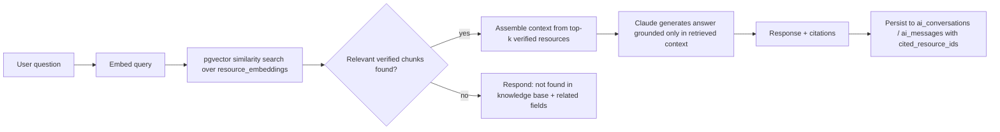

# AI Research Assistant — RAG Specification

## Non-negotiable behavior
The assistant must **never** generate an answer from general model knowledge alone. It answers only from content retrieved out of the verified knowledge base. If nothing relevant is retrieved, it says so explicitly and suggests adjacent fields/resources — it does not fill the gap with an invented answer.

## Knowledge sources (ingested into `resources` + `resource_embeddings`)
Research papers, books, articles, YouTube playlists, podcasts, Coursera courses, edX courses, official websites, internal documents, roadmaps.

## Pipeline

## Ingestion (separate background pipeline, not part of the chat request path)
1. New resource submitted (by admin, contributor, or automated feed).
2. Content chunked (target ~500–800 tokens per chunk with overlap).
3. Chunks embedded and stored in `resource_embeddings`.
4. `resources.verified` stays `false` until a moderator approves the source.
5. Only `verified = true` resources are retrievable by the assistant — this is enforced at the query level (`WHERE resources.verified = true`), not just in the UI.

## System prompt constraints (for whoever implements the Claude API call)
- Instruct the model explicitly to answer only from the provided context blocks.
- Instruct the model to say "not found in the verified knowledge base" rather than guess, when retrieval returns nothing relevant or low-confidence.
- Every generated answer must be paired with the resource IDs actually used, stored as `cited_resource_ids` — this is what the UI uses to render "Sources" links under the answer.

## Data model touchpoints
`ai_conversations` (user_id, title), `ai_messages` (conversation_id, role, content, cited_resource_ids uuid[]), `resource_embeddings` (resource_id, chunk_index, content_chunk, embedding vector(1536)).
